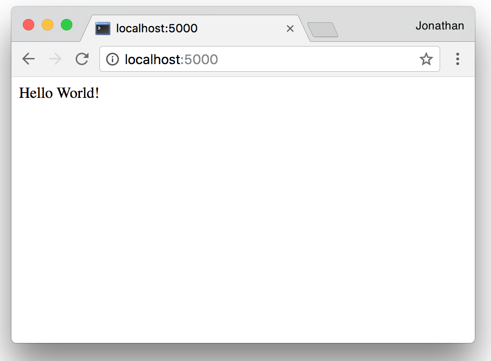

# EnvironmentSetup

You will need to prepare your system to run python and Flask. If you have previously used Flask, skip to the [testing](#testing) section to verify that your installation works. As you go through the tutorial, feel free to skip certain steps in the tutorial if you have already completed the instructions earlier.

### Table of Contents

1. [Mac OS Installation](#mac-osx)
	1. [Package Manager](#1-package-manager)
	2. [pip](#2-pip)
	3. [virtualenv and flask](#3-virtualenv-and-flask)
	4. [Testing](#4-testing)
	5. [Editor](#5-editors)
2. [Windows](#windows)
	1. [Python](#1-python)
	2. [pip](#2-pip)
-----
## Mac OSX
For the majority of the installation, we will be using the terminal. Don't worry if you're unfamiliar with it - we will walk you step by step through the installation.
Open terminal by simply typing it into the spotlight search.

**Note:** Whenever you see terminal inputs such as `$ echo "Hello World"` the `$` at the beginning of the line is just a convention to indicate the terminal - please do not add it to your actual command.

### 1. Package Manager
Your system has a preinstalled version of python that we have limited control over. You can type `python --version` into your terminal window to see your current python version. If you don't see `Python 2.7.13`, follow the rest of this step.

We want to maintain our own version of python which we are going to do via the Homebrew package manager for mac-osx.

1. Install homebrew by running the following command and following the printed instructions:
```shell
$ /usr/bin/ruby -e "$(curl -fsSL https://raw.githubusercontent.com/Homebrew/install/master/install)"
```

2. Update your brew references:
```shell
$ brew update
```

3. Install python
```shell
$ brew install python
```

4. If you run `python --version` now you should get the exact same output as before. It seems like we haven't done anything at all! The issue is because the newest version of homebrew installs python as `python2` on your system to distinguish it from the built in version. However, it can be annoying to type `python2` every time that we want to use python so we want to point our computer in the right direction to find the right python installation.
```shell
$ cd ~ # This will go to your root directory
$ echo "export PATH='/usr/local/opt/python/libexec/bin:$PATH'" >> .bashrc
$ source .bashrc
$ python --version
Python 2.7.14
```
If you got to this step then your python has been installed correctly!

### 2. pip
pip is the official package manager for python and allows you to install and manage third-party extensions to python. As we use python more and more, this tool becomes invaluable and you should spend some time playing around with it to see how it works.

1. If you followed [step 1](#1-package-manager) to install python with homebrew, then pip is installed and configured properly as well. Run `$ pip` to make sure that you get the help panel.

2. If for some reason you decided not to follow [step 1](#1-package-manager) and you don't have pip installed please contact a TA.

### 3. virtualenv and flask
virtualenv is an extremely useful tool that allows you to isolate your python development environments. Essentially, each virtualenv will contain a new and clean instance of python, pip, and your site packages. This way, if you install or update packages either in the global python scope or in another virtualenv, your changes will not affect this current virtualenv.

1. Make sure that pip in installed and run:
```shell
$ sudo pip install virtualenv
```

2. We are going to create our first virtualenv in this step. You should create a folder somewhere where you will plan to put all of your code for your web apps. We will refer to this folder as `$ACADEMY` in this section.

3. Turn your `$ACADEMY` folder into a virutalenv by using the command.
```shell
$ virtualenv /path/to/$ACADEMY
```
**NOTE:** Keep in mind that you have to provide either the relative or the absolute path to `$ACADEMY`.

4. To use your virtualenv, simply go into `$ACADEMY` (using `cd`, short for 'change directory') and activate the virtualenv.
```shell
$ cd /path/to/$ACADEMY
$ source ./bin/activate
```
You should see something like this after activating:
```shell
($ACADEMY) $
```
This indicates that you're in the `$ACADEMY` virtualenv.

5. We will install our first package in our new virutalenv.
```shell
($ACADEMY) $ pip install flask
```
The [flask library](http://flask.pocoo.org/docs/0.12/) contains the majority of the important functionality that we will use this semester.

6. To exit out of a virtualenv, simply enter `deactivate` in the terminal.


### 4. Testing
If you followed all of the previous steps without error, you should be able to run Flask now!
1. Make sure that your virtualenv is activated (remember: `$ source bin/activate`)

2. Copy and paste the following code into a file (don't worry if you don't understand what's going on - we'll be going into granular detail in the coming weeks!):
```python
from flask import Flask
app = Flask(__name__)

@app.route('/')
def index():
    return "Hello World!"

if __name__ == "__main__":
	app.run()
```

3. Save the file as `app.py` in `$ACACDEMY` and run `python app.py`. You should see:
```shell
($ACADEMY) $ python app.py
 * Running on http://127.0.0.1:5000/ (Press CTRL+C to quit)
 ```
4. Open a web browser and go to `localhost:5000` and you should see something like this!





### 5. Editors
Having a good text editor is essential to programming. However, the choice of editors between programmers can be a source of the most vehement passive-aggressiveness (which is what passes as conflict between coders). That being said, we have included a few options if you don't have a favorite yet.
##### [Sublime Text](https://www.sublimetext.com/)
**Used by:** Nick, Jonathan

An extremely popular, minimalistic editor that also has one of the biggest community of contributors who have created almost every possibly extension thought possible. Pick this one either if you don't want to choose or are just looking for a solid setup.

##### [Atom](https://atom.io/)
Another popular, minimalistic editor that was created by the guys at Github. Atom is very similar to Sublime Text with a comparable library of stable plugins and extensions to the language. Some people believe that Sublime Text is faster however while Atom boasts a cleaner interface. Choose this if you want to stir up fights with your basic teammates who all are using Sublime Text.

##### [Visual Code](https://code.visualstudio.com/)
An up and coming editor made by Microsoft and the people behind the madly popular Visual Studios suite (very different from Visual Code). There has been a sizable exodus from both the Sublime Text and Atom camp to this editor in the past few years. Check this one out if you want something a bit different or if Sublime Text and Atom are too dry for you. Also, if you choose this one, please let us know your thoughts.

##### [Pycharm](https://www.jetbrains.com/pycharm/)
**Used by:** Jonathan

This is hands-down the best editor for most things in python and especially flask. There is an overwhelming suite of different functionality that make your life as programmer worth living. As a student, you can even get the premium (read: expensive) version for free. However, this editor is not recommended for beginners as it is has a rather steep learning curve and will consume significantly more memory and resources on your computer than the others on this chart.

**NOTE:** While this may generate some consternation, *DO NOT USE VIM OR EMACS* or any other console based editor that some pseudo-programmer somewhere has told you will make you look 1337 or some other bullshit. You will regret every keystroke and your teammates will laugh at you. :(

## Windows
For the majority of the installation, we will be using command prompt (or Git Bash if you choose to). To access command prompt, press the start key and type in 'cmd' into the search bar and press enter.

**Note:** Whenever you see cmd inputs such as `$ echo "Hello World"` the `$` at the beginning of the line is just a convention to indicate the terminal - please do not add it to your actual command.

### 1. Python
If you have Python 2.7.13 already installed, you can skip this step. If you don't know if you do, you can type `python --version` into your terminal window to see your current python version. If you don't have Python 2.7.13 installed, follow these steps.

Install the python package from [here](https://www.python.org/downloads/windows/).  
_At the time of this writing, [Python 2.7.13](https://www.python.org/ftp/python/2.7.8/python-2.7.8.msi) is the latest._  
* Verify a successful installation by opening a command prompt window and navigating to your Python installation directory (default is `C:\Python27`).  Type `python` from this location to launch the Python interpreter.
    ```
    Microsoft Windows [Version 6.2.9200]
    (c) 2012 Microsoft Corporation. All rights reserved.
    
    C:\Users\Username>cd C:\Python27
    
    C:\Python27>python
    Python 2.7.8 (default, Jun 30 2014, 16:03:49) [MSC v.1500 32 bit (Intel)] on win
    32
    Type "help", "copyright", "credits" or "license" for more information.
    >>>
    ```
* It would be nice to be able to run Python from any location without having to constantly reference the full installation path name.  This can by done by adding the Python installation path to Windows' `PATH` `ENVIRONMENT VARIABLE`  
*_In Windows 7 and Windows 8, simply searching for "environment variables" will present the option to `Edit the system environment variables`. This will open the `System Properties / Advanced` tab_  
*_In Windows XP, right click on `My Computer->Properties` to open `System Properties` and click on the `Advanced` tab._  
 1. On the `System Properties / Advanced` tab, click `Environment Variables` to open `User Variables` and `System Variables`
 2. Create a new `System Variable` named Variable name: `PYTHON_HOME` and  Variable value: `c:\Python27` (or whatever your installation path was)  

 3. Find the system variable called `Path` and click `Edit`  

 4. Add the following text to the end of the Variable value:  `;%PYTHON_HOME%\;%PYTHON_HOME%\Scripts\`

 5. Verify a successful environment variable update by opening a new command prompt window (important!) and typing `python` from any location
    ```
    Microsoft Windows [Version 6.2.9200]
    (c) 2012 Microsoft Corporation. All rights reserved.
    
    C:\Users\Username>python
    Python 2.7.8 (default, Jun 30 2014, 16:03:49) [MSC v.1500 32 bit (Intel)] on win
    32
    Type "help", "copyright", "credits" or "license" for more information.
    >>>
    ```

4. If you run `python --version` now you should get the exact same output as before. It seems like we haven't done anything at all! The issue is because the newest version of homebrew installs python as `python2` on your system to distinguish it from the built in version. However, it can be annoying to type `python2` every time that we want to use python so we want to point our computer in the right direction to find the right python installation.
```shell
$ cd ~ # This will go to your root directory
$ echo "export PATH='/usr/local/opt/python/libexec/bin:$PATH'" >> .bashrc
$ source .bashrc
$ python --version
Python 2.7.14
```
If you got to this step then your python has been installed correctly!

### 2. pip
pip is the official package manager for python and allows you to install and manage third-party extensions to python. As we use python more and more, this tool becomes invaluable and you should spend some time playing around with it to see how it works.

* Download [get-pip.py](https://bootstrap.pypa.io/get-pip.py) to a folder on your computer. Open a command prompt window and navigate to the folder containing `get-pip.py`. Then run `python get-pip.py`. This will install `pip`.
* Verify a successful installation by opening a command prompt window and navigating to your Python installation's script directory (default is `C:\Python27\Scripts`).  Type `pip freeze` from this location to launch the Python interpreter.  
_`pip freeze` displays the version number of all modules installed in your Python non-standard library;  On a fresh install, `pip freeze` probably won't have much info to show but we're more interested in any errors that might pop up here than the actual content_
    ```
    Microsoft Windows [Version 6.2.9200]
    (c) 2012 Microsoft Corporation. All rights reserved.
    
    C:\Users\Username>cd c:\Python27\Scripts
    
    c:\Python27\Scripts>pip freeze
    antiorm==1.1.1
    enum34==1.0
    requests==2.3.0
    virtualenv==1.11.6
    ```
* It would be nice to be able to run Pip from any location without having to constantly reference the full installation path name.  If you followed the Python installation instructions above, then you've already got the pip install location (default = `C:\Python27\Scripts`) in your Windows' `PATH` `ENVIRONMENT VARIABLE`.  If you did not follow those steps, refer to them above now.
* Verify a successful environment variable update by opening a new command prompt window (important!) and typing `pip freeze` from any location
    ```
    Microsoft Windows [Version 6.2.9200]
    (c) 2012 Microsoft Corporation. All rights reserved.
    
    C:\Users\Username>pip freeze
    antiorm==1.1.1
    enum34==1.0
    requests==2.3.0
    virtualenv==1.11.6
    ```

### 3. virtualenv and flask
virtualenv is an extremely useful tool that allows you to isolate your python development environments. Essentially, each virtualenv will contain a new and clean instance of python, pip, and your site packages. This way, if you install or update packages either in the global python scope or in another virtualenv, your changes will not affect this current virtualenv.

1. Make sure that pip in installed and run:
'''shell
$ pip install virtualenv
'''

2. We are going to create our first virtualenv in this step. You should create a folder somewhere where you will plan to put all of your code for your web apps. We will refer to this folder as `$ACADEMY` in this section.

3. Turn your `$ACADEMY` folder into a virutalenv by using the command.
```shell
$ virtualenv "\path\to\$ACADEMY
```
**NOTE:** Keep in mind that you have to provide either the relative or the absolute path to `$ACADEMY`.

4. To use your virtualenv, simply go into `$ACADEMY` (using `dir`, short for directory) and activate the virtualenv.
```shell
$ cd \path\to\$ACADEMY
$ source .\bin\activate
```
You should see something like this after activating:
```shell
($ACADEMY) $
```
This indicates that you're in the `$ACADEMY` virtualenv.

5. We will install our first package in our new virutalenv.
```shell
($ACADEMY) $ pip install flask
```
The [flask library](http://flask.pocoo.org/docs/0.12/) contains the majority of the important functionality that we will use this semester.

6. To exit out of a virtualenv, simply enter `deactivate` in the terminal.


### 4. Testing
If you followed all of the previous steps without error, you should be able to run Flask now!
1. Make sure that your virtualenv is activated (remember: `$ source bin/activate`)

2. Copy and paste the following code into a file (don't worry if you don't understand what's going on - we'll be going into granular detail in the coming weeks!):
```python
from flask import Flask
app = Flask(__name__)

@app.route('/')
def index():
    return "Hello World!"

if __name__ == "__main__":
	app.run()
```

3. Save the file as app.py and run `python app.py`. You should see:
```shell
 * Running on http://127.0.0.1:5000/ (Press CTRL+C to quit)
 ```
4. Open a web browser and go to `localhost:5000` and you should see something like this!


### 5. Editors
Having a good text editor is essential to programming. However, the choice of editors between programmers can be a source of the most vehement passive-aggressiveness (which is what passes as conflict between coders). That being said, we have included a few options if you don't have a favorite yet.
##### [Sublime Text](https://www.sublimetext.com/)
**Used by:** Nick, Jonathan

An extremely popular, minimalistic editor that also has one of the biggest community of contributors who have created almost every possibly extension thought possible. Pick this one either if you don't want to choose or are just looking for a solid setup.

##### [Atom](https://atom.io/)
Another popular, minimalistic editor that was created by the guys at Github. Atom is very similar to Sublime Text with a comparable library of stable plugins and extensions to the language. Some people believe that Sublime Text is faster however while Atom boasts a cleaner interface. Choose this if you want to stir up fights with your basic teammates who all are using Sublime Text.

##### [Visual Code](https://code.visualstudio.com/)
An up and coming editor made by Microsoft and the people behind the madly popular Visual Studios suite (very different from Visual Code). There has been a sizable exodus from both the Sublime Text and Atom camp to this editor in the past few years. Check this one out if you want something a bit different or if Sublime Text and Atom are too dry for you. Also, if you choose this one, please let us know your thoughts.

##### [Pycharm](https://www.jetbrains.com/pycharm/)
**Used by:** Jonathan

This is hands-down the best editor for most things in python and especially flask. There is an overwhelming suite of different functionality that make your life as programmer worth living. As a student, you can even get the premium (read: expensive) version for free. However, this editor is not recommended for beginners as it is has a rather steep learning curve and will consume significantly more memory and resources on your computer than the others on this chart.

**NOTE:** While this may generate some consternation, *DO NOT USE VIM OR EMACS* or any other console based editor that some pseudo-programmer somewhere has told you will make you look 1337 or some other bullshit. You will regret every keystroke and your teammates will laugh at you. :(
